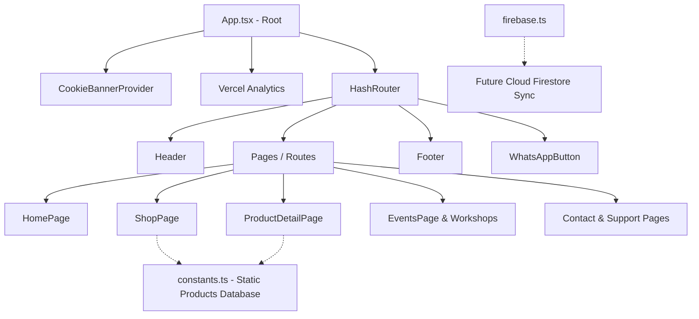

# 🌟 Mándalo Bonito — E-Commerce Artesanal de Resina Premium

¡Bienvenido a **Mándalo Bonito**! Esta plataforma web ha sido diseñada y construida a medida para digitalizar y elevar un taller artesanal enfocado en la creación de piezas únicas y personalizadas de resina epoxi de alta calidad. 

A continuación se detalla una explicación profunda del sitio web a nivel **usuario (UX/UI)** y a nivel **técnico (arquitectura y desarrollo)**, justificando por qué ha sido concebido de esta manera y cómo es su funcionamiento interno.

---

## 👥 1. Perspectiva del Usuario (User Level)

### ¿Por qué se creó Mándalo Bonito?
El mercado de la artesanía en resina exige una experiencia de compra sumamente visual y personalizada. Cada pieza es una obra de arte única y no hay dos iguales. Por ello, Mándalo Bonito no fue diseñado como una tienda de comercio electrónico genérica y fría. Se creó para transmitir **exclusividad, calidez, detalle y cercanía**, permitiendo a los clientes apreciar la belleza del producto antes de adquirirlo y posibilitando una comunicación fluida para encargos personalizados.

### Funcionamiento y Experiencia de Usuario (UX)

*   **Catálogo Dinámico e Interactivo ([ShopPage.tsx])**: Los usuarios pueden explorar el catálogo completo filtrando dinámicamente por categorías refinadas (como *Decoración*, *Juegos*, *Posavasos*, *Llaveros*, *Complementos*, y *Días Especiales*).
*   **Fichas de Detalle Sensoriales ([ProductDetailPage.tsx])**: Al hacer clic en un producto, el usuario accede a una experiencia detallada. Puede visualizar múltiples imágenes reales a través de una galería interactiva, leer descripciones emocionales y técnicas sobre el acabado en resina y ver las variantes de tamaño o sets disponibles.
*   **Personalización y Contacto Directo**: Como el valor añadido de Mándalo Bonito es la creación a medida (colores, brillos, flores prensadas, nombres encapsulados), el sistema integra llamadas directas a **WhatsApp** y formularios de contacto en [ContactPage.tsx] para que el cliente finalice la personalización con el artesano de forma inmediata.
*   **Sección de Formación y Comunidad [EventsPage.tsx] y [WorkshopsPage.tsx]**: La web no solo vende, sino que educa. Integra secciones para reservar talleres presenciales de vertido de resina y un espacio dedicado a la venta de cursos online ([OnlineCoursePage.tsx]) para entusiastas del sector.
*   **Aparato Legal Transparente**: Se incluye todo lo necesario para cumplir con las normativas vigentes del RGPD, aviso legal, términos de reembolso y preguntas frecuentes ([FaqPage.tsx]) para infundir total confianza al comprador.

---

## 🛠️ 2. Perspectiva Técnica (Technical Level)

La arquitectura de la web fue construida utilizando tecnologías frontend de última generación para garantizar **máxima velocidad de carga, interactividad fluida y facilidad de mantenimiento**.

### Arquitectura de Software y Decisiones Clave

1.  **Vite + React (TypeScript) como Núcleo**:
    *   **¿Por qué Vite?**: Ofrece una compilación y recarga en caliente (HMR) casi instantánea, ideal para un ciclo de desarrollo ágil.
    *   **¿Por qué TypeScript?**: Provee tipado estricto para las entidades principales del sistema (por ejemplo), la definición estricta del tipo `Product` en [types.ts], evitando errores comunes durante la compilación y asegurando que las variantes de precios y fotos siempre estén estructuradas correctamente.
2.  **Tailwind CSS v4 (Motor de Estilos de Nueva Generación)**:
    *   Integrado en [index.css] con el nuevo estándar `@theme`.
    *   Permite un control granular del diseño responsivo mediante utilidades altamente optimizadas.
    *   Define una identidad visual de marca unificada a través de variables personalizadas (colores como `brand-cream`, `brand-silk`, `brand-brown` y `brand-gold`, y tipografías premium como *Montserrat* para lectura cómoda y *Playfair Display* para títulos elegantes de lujo).
3.  **React Router (HashRouter)**:
    *   **¿Por qué HashRouter?**: Se ha utilizado `HashRouter` en lugar de `BrowserRouter`. En plataformas de alojamiento estático tradicionales (como GitHub Pages o ciertos servidores Apache), las rutas dinámicas como `/catalogo/ajedrez` devuelven errores HTTP 404 al recargar la página. Al usar rutas basadas en hash (`/#/catalogo/ajedrez`), la navegación se maneja enteramente en el lado del cliente, garantizando que **la web nunca falle ni se rompa al actualizar el navegador**.
4.  **Resin Gloss Effect & Sharpness Filter (Micro-animaciones Estéticas)**:
    *   En [index.css], se ha implementado un filtro CSS personalizado llamado `.resin-filter`. 
    *   Este filtro optimiza el contraste y la saturación de las imágenes de los productos artesanales y, mediante un pseudoelemento `::after` con un gradiente lineal y una transformación `skewX`, genera un **destello de luz brillante reflectante** que cruza el producto al pasar el ratón por encima (hover), imitando de forma interactiva el acabado brillante de la resina epoxi pulida.
    *   Se ha establecido una transición global (`* { transition: all 0.3s cubic-bezier(0.4, 0, 0.2, 1); }`) para asegurar que todos los cambios de estado sean suaves y fluidos.
5.  **Firebase & Firestore Ready ([firebase.ts])**:
    *   La base de datos de Firebase (Cloud Firestore) está configurada e inicializada. Aunque actualmente la tienda carga los productos desde el archivo estático de configuración [constants.ts] para optimizar el rendimiento inicial de carga offline, la arquitectura está completamente preparada para que en el futuro se puedan leer los productos de forma dinámica, gestionar reservas de eventos, y guardar leads de contacto en la nube en tiempo real.
6.  **Cookies & Analíticas de Rendimiento Silenciosas**:
    *   Integra un `CookieBannerProvider` modular que bloquea cualquier script de rastreo hasta que el usuario dé su consentimiento expreso de acuerdo con las normativas europeas RGPD.
    *   Usa el script ultraligero `@vercel/analytics` para recopilar métricas de rendimiento del sitio de manera no intrusiva y respetuosa con la privacidad.

---

## 📂 3. Estructura de Directorios Clave

Para mantener el proyecto limpio y optimizado, la estructura de carpetas se organiza así:

*   **`src/`**: Contiene la lógica del frontend.
    *   **`pages/`**: Vistas completas de la aplicación web (Inicio, Tienda, Detalle, Talleres, Políticas, etc.).
    *   **`components/`**: Fragmentos de interfaz reutilizables (Encabezado, Pie de página, Botón de WhatsApp, Banner de Cookies).
*   **`public/`**: Es la carpeta fuente obligatoria para recursos estáticos que deben servirse intactos.
    *   **`public/img/`**: **Aquí residen las 98 imágenes reales del proyecto** (logotipo, productos, fotos de talleres). Al compilar con Vite, todo este contenido se clona automáticamente a la carpeta de distribución final.
    *   > [!IMPORTANT]
        > Se ha eliminado la carpeta `img` duplicada en la raíz del proyecto para evitar redundancias y consumo de espacio en el disco duro, centralizando todo el catálogo gráfico exclusivamente dentro de `public/img/`.
*   **`dist/`**: Carpeta autogenerada con el empaquetado final optimizado (HTML, JS y CSS minificados) listo para producción. Se puede borrar en cualquier momento y se volverá a crear ejecutando `npm run build`.
